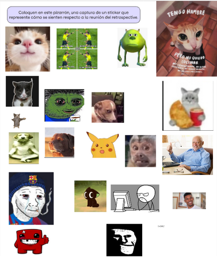
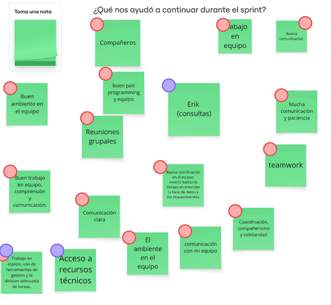
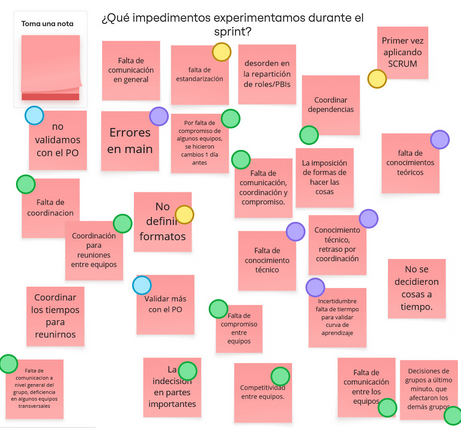
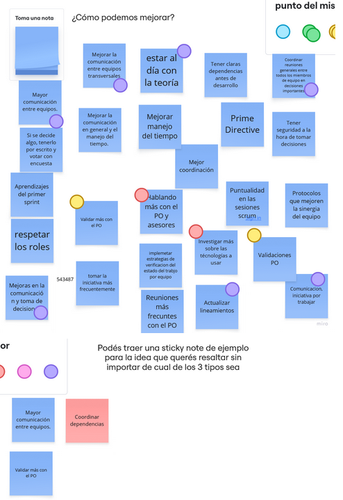
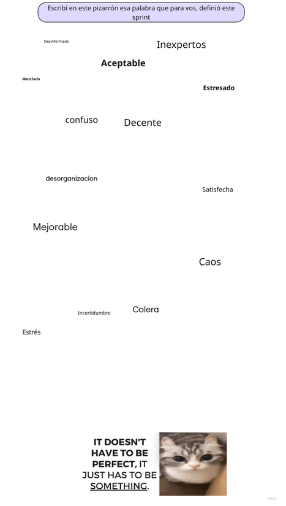

# Sprint Retrospective 

**Sprint 0 | 2025-1**  
**SQLit(s)**  
**8/5/2025 - 35 min**

## Table of Contents

- [Key Points from the Meeting](#key-points-from-the-meeting)
  - [What went well?](#what-went-well)
  - [What have we learned?](#what-have-we-learned)
  - [What could we improve?](#what-could-we-improve)
  - [What is still confusing?](#what-is-still-confusing)
- [Action Items and Process Decisions](#action-items-and-process-decisions)
  - [General](#general)
    - [Action items and process decisions](#action-items-and-process-decisions-1)
  - [By Team](#by-team)
    - [Sprinters](#sprinters)
    - [SQLits](#sqlits)
    - [Prequels](#prequels)
    - [#C prendió++](#c-prendió)
- [Annexes](#annexes)
  - [Check-in](#check-in)
  - [Energizer (Kahoot)](#energizer-kahoot)
  - [Main Retrospective](#main-retrospective)
  - [Check-out](#check-out)

## Key Points from the Meeting

### What went well?

- Use of tools.
- Good teamwork, with positive relationships between members; camaraderie, solidarity, and patience were shown.
- Good communication.
- Proper division of tasks among teams.
- Ability to conduct effective pair programming.
- Resolution of doubts and effective use of technical advisor consultations.

### What have we learned?

- New technologies.
- New methodologies.
- New tools.
- The importance of communication.
- The value and impact of defining standardized processes.
- That making mistakes when making decisions is not a bad thing.

### What could we improve?

- Communication between teams.
- Confidence in decision-making.
- Standardization.
- Perform more validations with the PO.
- Reduce errors in the main.
- Greater commitment from the teams.
- Coordination when there are dependencies between teams.
- Consider other teams when making decisions, avoid imposing ways of doing things.
- Technical responsibility.
- View all involved parties as a unit working toward the best outcome.
- Avoid last-minute decisions.
- Greater adherence to the prime directive.
- Respect for roles.
- Time management.

### What is still confusing?

- How to envision the project in the future, as perceptions change with each sprint.
- Implementation challenges due to lack of technical/practical knowledge of methodologies, tools, and languages.

## Action Items and Process Decisions

### General

#### Action items and process decisions

- Use the general chat more to communicate relevant information.
- Don't rely solely on people with specific roles; they are just support.
- Change the standardization of processes involving GIT.
- Increase individual and group commitment to the project.
- Don't make decisions that affect other teams independently.
- Be more open in expressing opinions about group decisions.
- Use polls in the general chat to make decisions and avoid group bias.
- Communicate decisions made in Scrum or cross-functional teams to all involved parties.
- Constantly validate correctness with the PO and, if relevant, with other teams.

### By Team

#### Action items and process decisions

##### **Sprinters**

- Add more members to some cross-functional groups.
- Improve information sharing with other teams.
- Coordinate important agreements well in advance.

##### **SQLits**

- Organize topics related to the standardization of functionalities.
- Organize meetings with technical advisors and the PO.
- Encourage team members to share lessons learned during retrospectives to foster continuous improvement.
- Establish a protocol for handling last-minute decisions to minimize their impact.
- Promote adherence to the prime directive by organizing a team-building activity focused on mutual respect and collaboration.

##### **Prequels**

- Improve communication with teams dependent on the entities we work on.
- Request more meetings with technical advisors and the PO to ensure better validation of the process.
- Improve group communication to standardize formats and interfaces.

##### **#C prendió++**

- Validate more frequently with the PO.
- Organize meetings with technical advisors.
- Improve communication both within the team and with other teams.
- Hold more daily meetings to clarify what each member has done and any issues they're facing.

## Annexes

- ### Check-in

  

- ### Energizer (Kahoot)

  

- ### Main Retrospective

  

- ### Check-out

