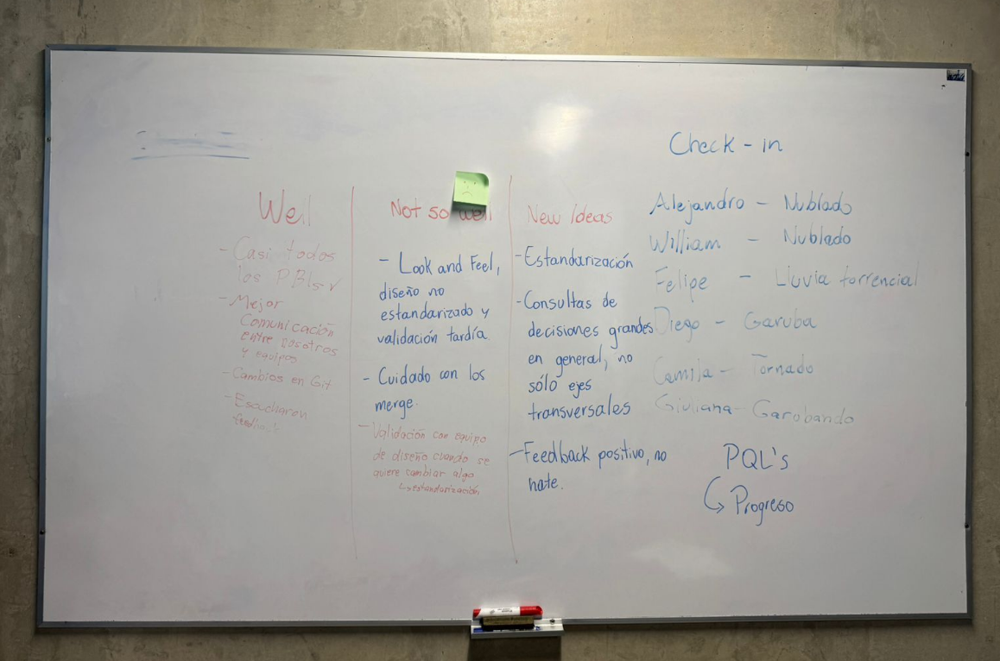
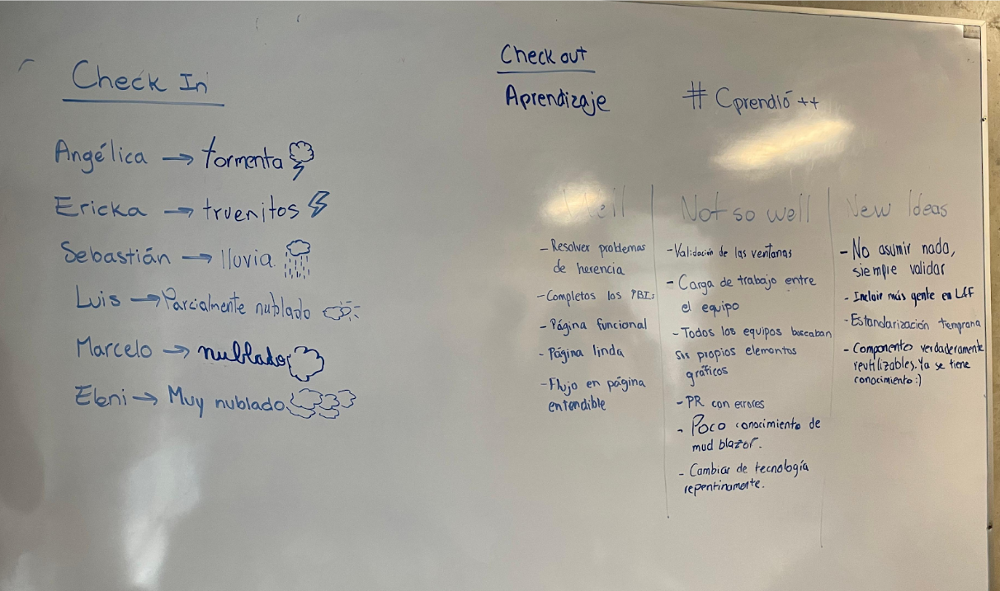
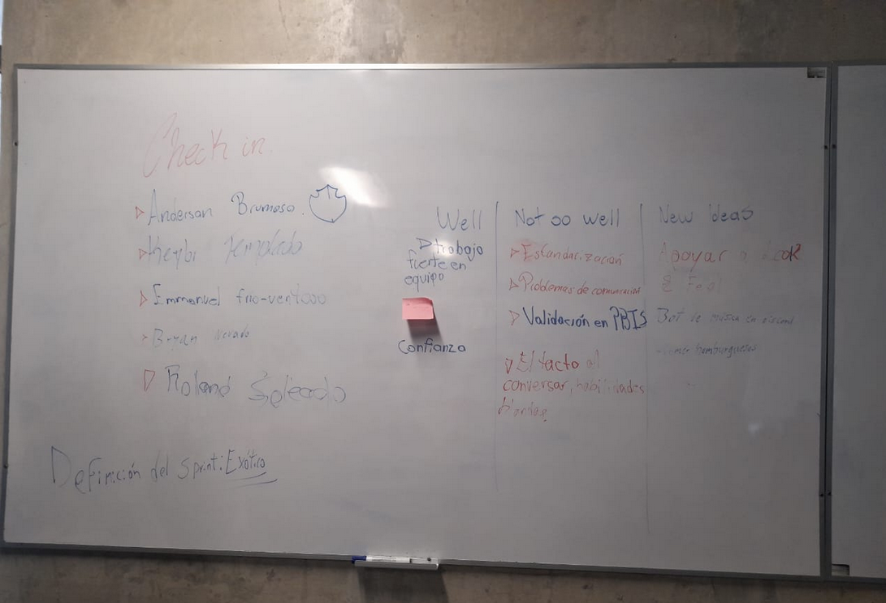
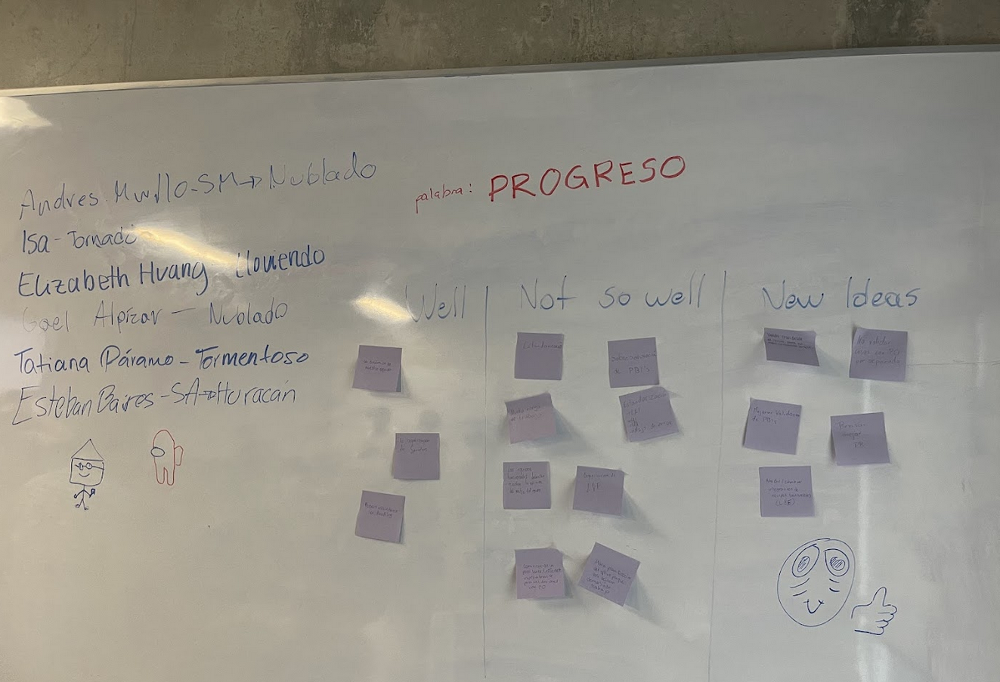

# Sprint Retrospective

Sprint 1 | 2025-1

Prequels

May 28, 2025 – 40 min

## Table of Contents

- [Key Points from the Meeting](#key-points-from-the-meeting)
  - [What went well?](#what-went-well)
  - [What didn’t go so well?](#what-didnt-go-so-well)
  - [New ideas?](#new-ideas)
- [List of Action Items and Process Decisions](#list-of-action-items-and-process-decisions)
  - [General](#general)
  - [By Team](#by-team)
    - [Sprinters](#sprinters)
    - [SQLit(s)](#sqlits)
    - [Prequels](#prequels)
    - [#Cprendió++](#cprendió)
- [Meeting Attachments](#meeting-attachments)
  - [Prequels](#prequels-activity)
  - [#Cprendió++](#cprendió++-activity)
  - [SQLit(s)](#sqlits-activity)
  - [Sprinters](#sprinters-activity)

## Key Points from the Meeting

### What went well?

- Good teamwork, strong relationships between members, demonstrated camaraderie, solidarity, and patience.
- Good communication.
- Quick learning of new technologies.
- Most PBIs were completed.
- Git changes improved integration.
- Teams listened to feedback.
- Better agreements between cross-functional teams.

### What didn’t go so well?

- Design standardization.
- Inadequate validations.
- Merge issues into main introduced errors.
- Handling of emotions and stress.
- Planning.

### New ideas?

- Include all developers in the frontend standardization process.
- Large inquiries should be made through the general chat — don’t leave all feedback to the cross-functional leads.
- Plan things earlier.
- Review pull requests more thoroughly.

## List of Action Items and Process Decisions

### General

- Standardizing the website design is important.
- Increase participation in cross-functional roles by non-members to avoid overloading current members.

### By Team

#### Sprinters

- Improve coordination and support with L&F (Look & Feel) team members.
- Validate high-priority features with the PO (Product Owner) earlier.
- Seek more support from technical advisors to better manage technical uncertainty.

#### SQLit(s)

- Coordinate with other teams to improve standardization of features and interface.
- Hold more validation meetings with the PO and technical advisors.
- Support the cross-functional Look and Feel team.
- Increase communication and coordination with teams we depend on and those that depend on us.

#### Prequels

- Better coordination in interface standardization.
- Request validations earlier to avoid last-minute changes.
- Improve internal workload distribution.

#### #Cprendió++

- Don’t assume anything — always validate with the PO, no matter how small.
- Standardize Look and Feel; support the cross-functional team more, since everyone depends on it.
- Intra- and inter-team communication remains an area for improvement.

## Meeting Attachments

This includes the check-in, energizer, the main retrospective board, and the check-out, by team.

## Prequels-activity

## #Cprendió++-activity

  

## SQLit(s)-activity

  

## Sprinters-activity

  
