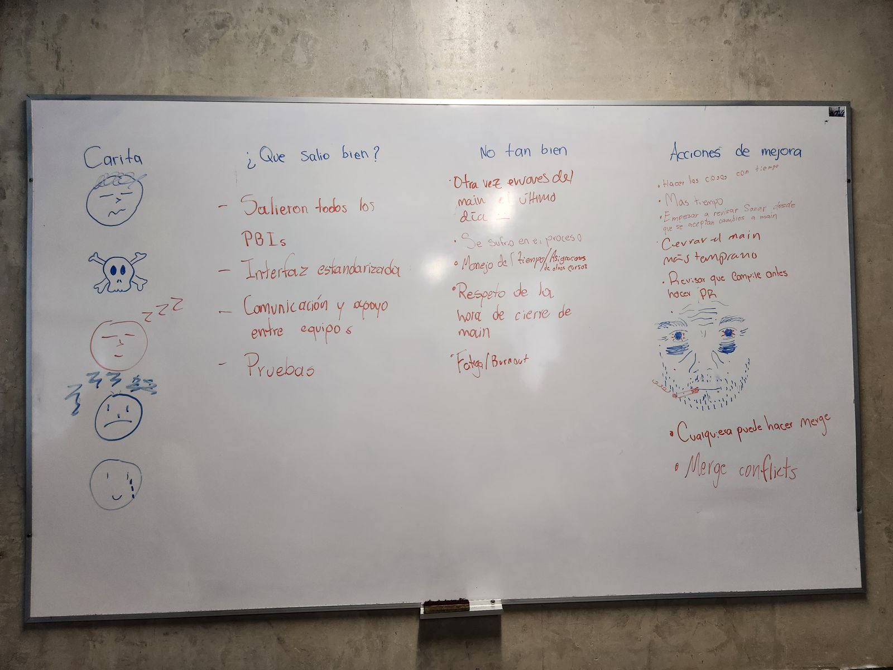
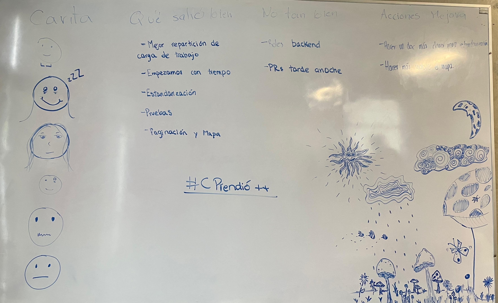
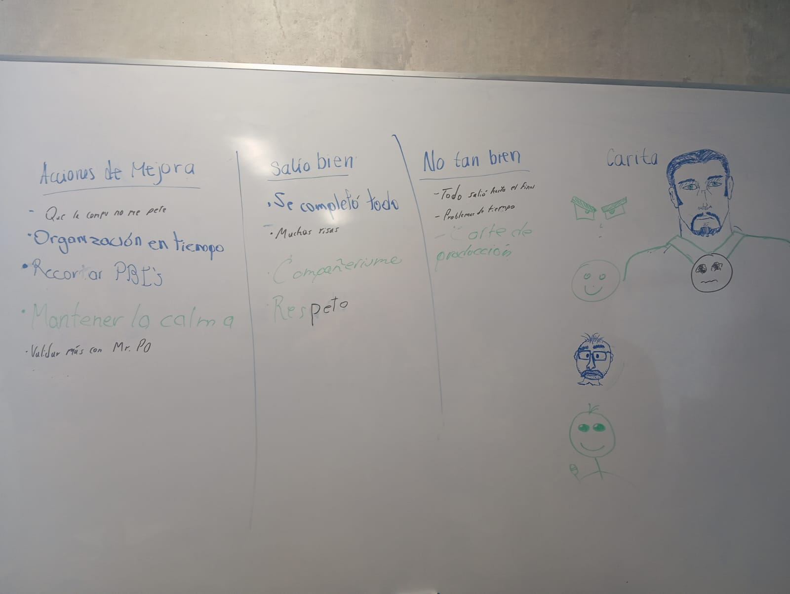
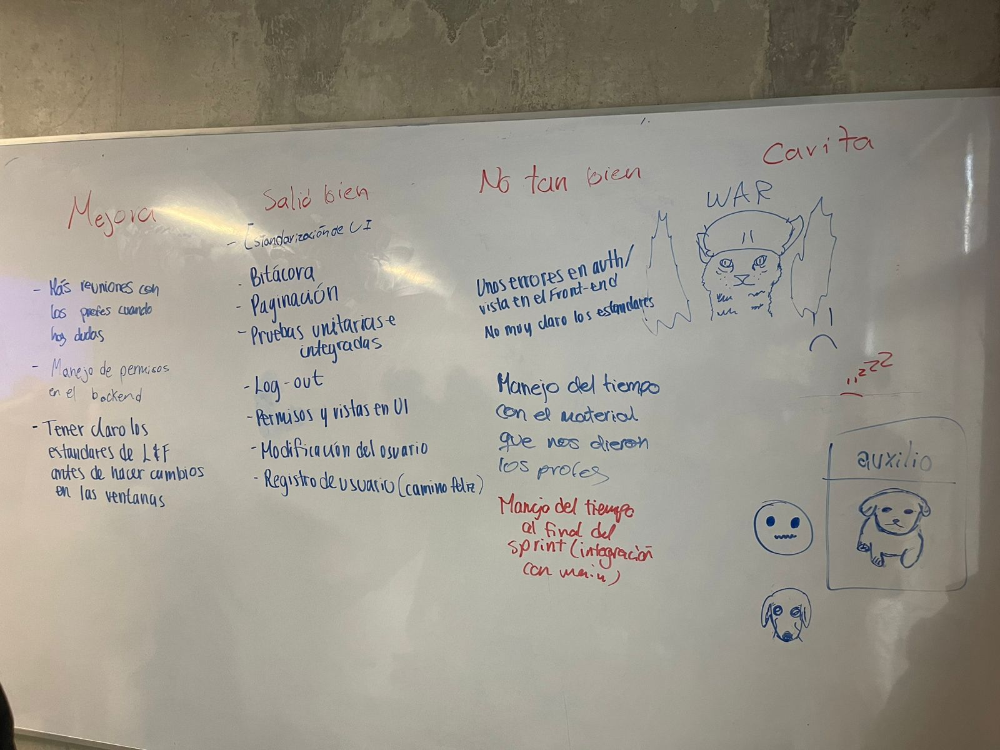

# Sprint Retrospective

**Sprint 2**

**Sprinters**

**June 18, 2025**

## Key Points from the Meeting

### What went well?

* **Work distribution and organization:** Tasks were better distributed, started on time, and PBIs were well organized.
* **Standardization:** Interface and other technical aspects were standardized across several teams.
* **Testing:** Unit and integration tests were conducted.
* **Teamwork:** Good communication and support between teams, respect and camaraderie were present.
* **Completed functionalities:** All planned features were completed (pagination, map, logout, permissions, logs, etc.).

### What didn’t go so well?

* **Timing and deliveries:**

  * PRs and merges were made very late (last day or at night).
  * Main branch closing times were ignored.
  * Poor time management due to other assignments and tasks.
  * Fatigue and burnout in some teams.

* **Technical issues:**

  * Errors in authentication and frontend views.
  * Production outage.

* **Lack of clarity:**

  * Unclear standards.
  * Confusion regarding instructors’ materials.
  * Roles and permissions in the backend were not properly completed.

### New ideas?

* **Documentation and standardization:**

  * Create a clearer document on standards.
  * Validate more frequently with the Product Owner (PO).

* **Time management:**

  * Perform merges and PRs earlier.
  * Organize PBIs and tasks with more anticipation.

* **Tools and workflow:**

  * Anyone can merge, but must ensure it compiles and the database works correctly (Git team must agree).
  * Improve conflict management during merges.

* **Quality and support:**

  * Have meetings with instructors when in doubt.
  * Validate changes with standards before applying them.

## List of Action Items and Process Decisions

### General

* Improve planning by starting tasks earlier, standardize using clear documentation, submit PRs and merges in advance, validate with the PO and advisors, and allow any member to merge as long as the code compiles properly.

### By Team

#### Sprinters

* Have more meetings with instructors when there are questions.
* Improve backend permissions handling.
* Clarify Look & Feel (L\&F) standards before making changes to windows.

#### SQLit(s)

* Prevent computer issues.
* Improve time organization.
* Remember PBIs.
* Stay calm.
* Validate more with the PO.

#### Prequels

* Do things on time.
* Allocate more time.
* Start reviewing Sonar as soon as changes are accepted into main.
* Close the main branch earlier.
* Check that the code compiles before making a PR.
* Anyone can merge.
* Merge conflicts.

#### #Cprendió++

* Create a clearer document for standardization.
* Make the map more usable.

## Retrospective Images

### Prequels

### #Cprendio++

  

### SQLit(s)

  

### Sprinters

  
