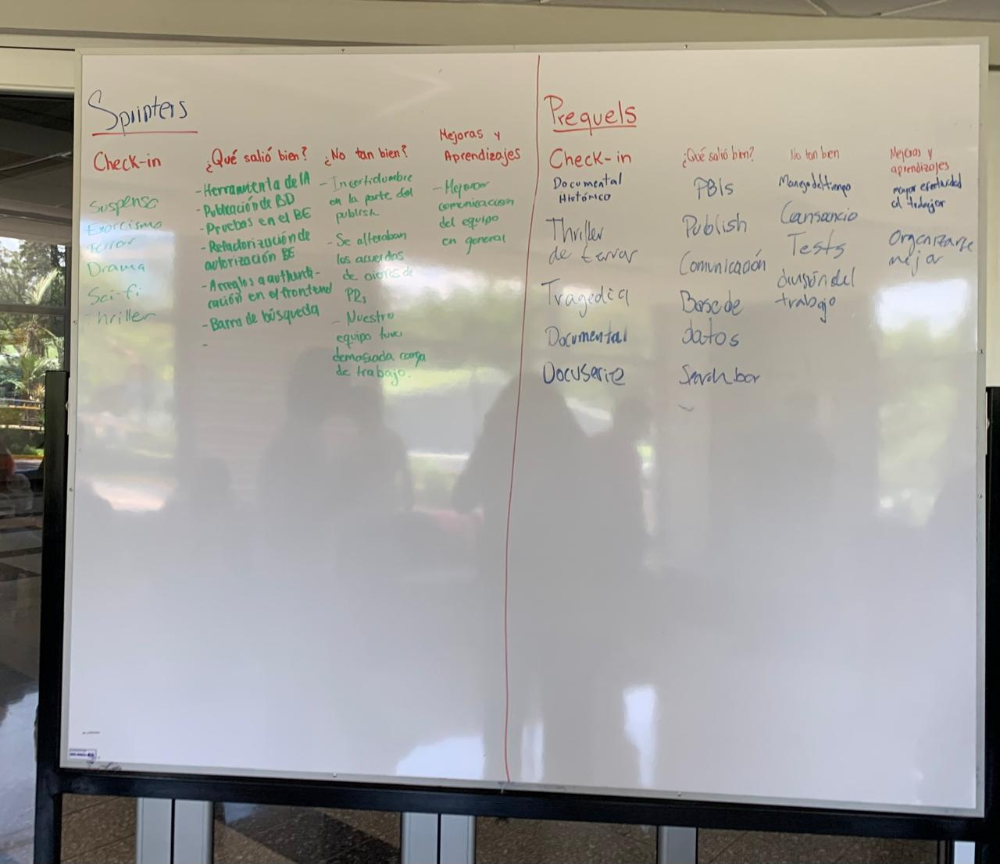
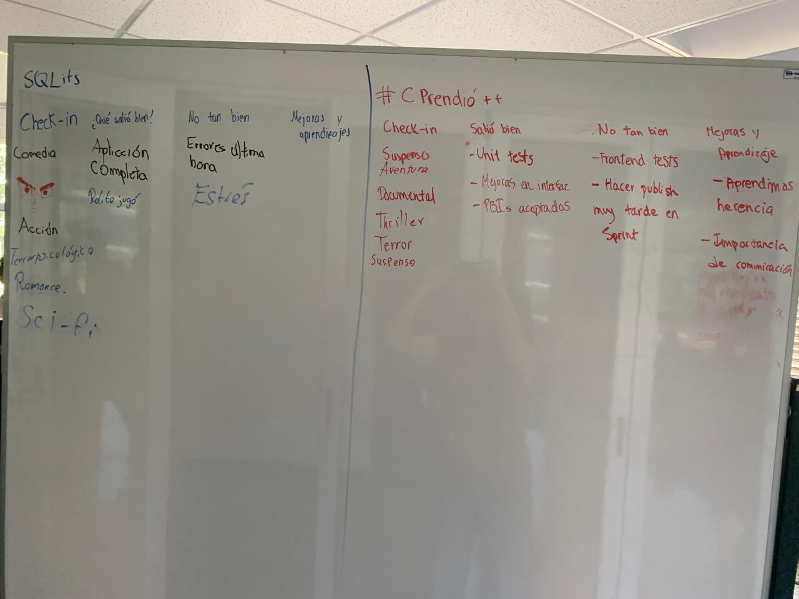

# Sprint Retrospective

**Sprint 3**

**#C prendió ++**

**July 09, 2025**

## Key Points from the Meeting

### What went well?

- All planned functionalities for the sprint were successfully completed, like the audit logs, AI tool integration, application deployment, search bar, and authentication system.

- Both unit and integration tests were implemented, contributing to a solid testing foundation.

- We increased the level of test coverage.

- The user interface design was improved.

- Communication within the team was effective.

### What didn’t go so well?

- Last-minute errors caused some stress and required quick fixes near the end of the sprint.

- There were technical uncertainties related to publishing the backend and frontend for deployment.

- Some doubts arose during the implementation of specific tests.

- Time management for the publishing process could have been better, as it felt rushed.

- Team members experienced fatigue, especially towards the end of the sprint.

- Task distribution was not optimal, leading to an uneven workload.

- One pull request was submitted late.

### Lessons Learned

- Throughout the sprint and the project as a whole, we recognized the importance of clear and consistent communication to ensure smooth collaboration and alignment.

- Maintaining a consistent coding style across the team made it easier to read, understand, and contribute to each other's code.

- The importance of proper time management and balanced task distribution to reduce last-minute stress and ensure steady progress.

## List of Improvements

### General

- Always aim to start tasks early to avoid last-minute issues and allow time for proper testing and review.

- Emphasize the importance of continuous integration to catch problems early and maintain a stable development flow.

- Focus on maintaining a steady and sustainable work pace throughout the sprint to avoid burnout and rushed deliveries.

### By Team

#### Sprinters

- Strengthen overall team communication to reduce misunderstandings and improve coordination.

- Balance workload more evenly across teams to ensure fair contributions.

#### SQLit(s)

- Improve time organization.

#### Prequels

- Improve effectiveness while working.

- Enhance time organization to better handle workload and deadlines.

#### #Cprendió++

- Improve communication within the group to stay aligned and resolve issues more efficiently.

## Retrospective Images

### Prequels & Sprinters

### #Cprendio++ & SQLit(s)

  
